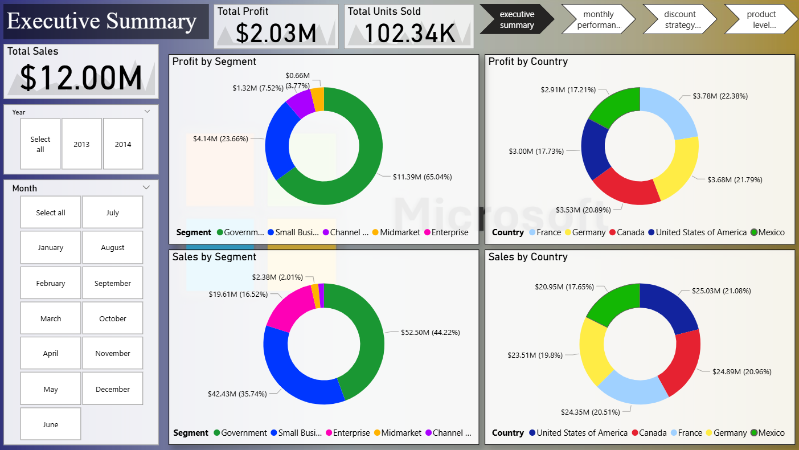
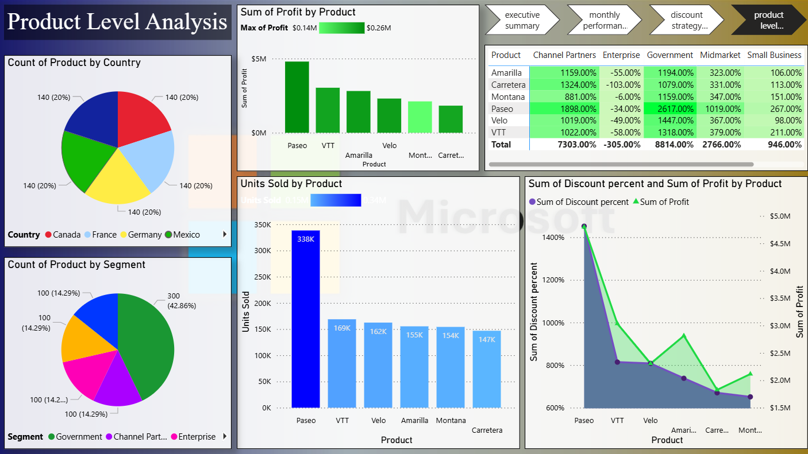

# Microsoft-sales-profit-analysis

## 📌 Project Overview
This project demonstrates the design and delivery of a Business Performance Dashboard using Power BI with SQL‑based data preparation. The dashboard provides a comprehensive view of sales, profit, units sold, discount strategy, and product‑level performance across multiple countries and business segments.

The goal of this project is to showcase end‑to‑end BI delivery: from data extraction and transformation using SQL, to visualization and storytelling in Power BI, aligned with corporate reporting standards.

## 📊 Dataset
The dataset used in this project is the Financial Sample Excel Workbook provided by Microsoft. You can download it directly from Microsoft Learn: [Download the Financial Sample Excel workbook](https://learn.microsoft.com/en-us/power-bi/create-reports/sample-financial-download)

The dataset contains sales and profit data segmented by country, product, and business type, making it suitable for financial and operational reporting use cases.

## ⚙️ Tools and Skills Demonstrated
- SQL: Data extraction, joins, aggregations, and transformations for reporting.

- Power BI: Dashboard design, KPI cards, donut charts, line charts, bar charts, and treemaps.

- Business Intelligence Concepts: MIS reporting, executive summaries, discount strategy analysis, and product‑level insights.

- Data Storytelling: Translating raw data into recruiter‑grade, stakeholder‑ready visuals.

## 📂 Files
- `.pbix` file for Power BI dashboard

- `.txt` file for SQL codes used in analysis

- `visuals` folder for dashboard screenshots

## 📈 Dashboard Views

### Executive Summary  
 

### Monthly Performance  

### Discount Strategy  

### Product Level Analysis  

## 🚀 Business Impact
- This dashboard enables stakeholders to:

- Track total sales, profit, and units sold at a glance.

- Compare performance by country and business segment.

- Identify the impact of discount strategies on profit margins.

- Evaluate product‑level performance for strategic decision‑making.

- Enables stakeholders to track and monitor total sales, profit, and units sold at a glance.

- Supports executives in evaluating product‑level performance for strategic decision‑making.

## 📌 Key Takeaways
- Demonstrates end‑to‑end BI delivery using SQL and Power BI.

- Highlights corporate‑grade dashboard design with executive readability.

- Provides a portfolio‑ready case study for analytics and reporting roles.
